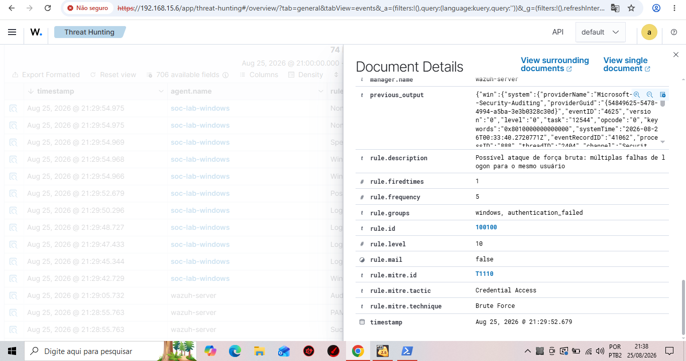

# Laboratório 05 — Detecção de Força Bruta no Wazuh

## Objetivo

Este laboratório tem como objetivo simular e detectar múltiplas falhas de autenticação em um endpoint Windows utilizando o Wazuh SIEM.

A partir de eventos reais de falha de logon do Windows, foi criada uma regra customizada de correlação no Wazuh para identificar várias tentativas de autenticação malsucedidas direcionadas ao mesmo usuário dentro de uma janela de tempo definida.

O objetivo é reproduzir uma situação compatível com uma tentativa de força bruta e gerar um alerta de maior severidade para investigação por um analista SOC.

---

## Ambiente

- SIEM: Wazuh 4.14.7
- Endpoint: Windows
- Agente monitorado: `soc-lab-windows`
- Fonte dos eventos: Windows Security Event Log
- Evento monitorado: Windows Event ID `4625`
- Regra base Wazuh: `60122`
- Regra customizada: `100100`

---

## Cenário

Foram realizadas múltiplas tentativas controladas de autenticação utilizando uma senha incorreta.

Cada tentativa malsucedida gerou no Windows:

`Event ID 4625 — An account failed to log on`

Os eventos foram coletados pelo agente Wazuh e inicialmente classificados pela regra:

`60122 — Logon Failure - Unknown user or bad password`

A regra padrão possui nível de severidade 5.

O objetivo do laboratório foi correlacionar múltiplas ocorrências desse evento para o mesmo usuário e elevar a severidade quando o comportamento atingisse o limite definido.

---

## Regra customizada

Foi adicionada ao arquivo:

`/var/ossec/etc/rules/local_rules.xml`

a seguinte regra:

```xml
<group name="windows,authentication_failed,">

  <rule id="100100" level="10" frequency="5" timeframe="60">
    <if_matched_sid>60122</if_matched_sid>
    <same_field>data.win.eventdata.targetUserName</same_field>
    <description>Possível ataque de força bruta: múltiplas falhas de logon para o mesmo usuário</description>
    <mitre>
      <id>T1110</id>
    </mitre>
  </rule>

</group>
```

---

## Lógica de detecção

A regra customizada utiliza três elementos principais de correlação.

### `if_matched_sid`

```xml
<if_matched_sid>60122</if_matched_sid>
```

A regra monitora ocorrências anteriores da regra Wazuh `60122`, responsável pela identificação de falhas de autenticação por usuário desconhecido ou senha incorreta.

### `frequency`

```xml
frequency="5"
```

Define o número de ocorrências utilizado pela regra para identificar o comportamento repetitivo.

### `timeframe`

```xml
timeframe="60"
```

Define uma janela temporal de 60 segundos para a correlação dos eventos.

### `same_field`

```xml
<same_field>data.win.eventdata.targetUserName</same_field>
```

Determina que os eventos correlacionados devem estar associados ao mesmo valor do campo `targetUserName`.

Isso permite detectar múltiplas falhas direcionadas ao mesmo usuário em vez de simplesmente contar falhas de autenticação não relacionadas.

---

## Cadeia de detecção

```text
Tentativa de autenticação
        ↓
Senha incorreta
        ↓
Windows Event ID 4625
        ↓
Wazuh Rule 60122
        ↓
Múltiplas falhas para o mesmo usuário
        ↓
Correlação temporal
        ↓
Regra customizada 100100
        ↓
Alerta Wazuh nível 10
        ↓
MITRE ATT&CK T1110 — Brute Force
```

---

## Resultado

Após a execução de múltiplas tentativas de autenticação malsucedidas, o Wazuh correlacionou os eventos e disparou a regra customizada.

O alerta gerado apresentou:

| Campo | Valor |
|---|---|
| Rule ID | 100100 |
| Rule Level | 10 |
| Frequency | 5 |
| Evento base | Windows Event ID 4625 |
| Regra base | 60122 |
| MITRE ATT&CK | T1110 |
| Tática | Credential Access |
| Técnica | Brute Force |

Descrição do alerta:

> Possível ataque de força bruta: múltiplas falhas de logon para o mesmo usuário

---

## Evidência

A captura abaixo demonstra o alerta gerado pelo Wazuh após a correlação das falhas de autenticação.



**Evidência 01 — Regra customizada 100100 acionada após múltiplas falhas de autenticação, classificada como MITRE ATT&CK T1110 — Brute Force.**

---

## Análise SOC

Uma única falha de autenticação pode ocorrer por erro legítimo do usuário e, isoladamente, normalmente não representa evidência suficiente de atividade maliciosa.

Entretanto, várias falhas de autenticação direcionadas ao mesmo usuário em um curto intervalo de tempo aumentam a relevância do evento.

Neste laboratório, a correlação transforma vários eventos individuais de nível 5 em um alerta customizado de nível 10.

Em um ambiente corporativo, um analista SOC poderia utilizar esse alerta como ponto inicial para investigar:

- usuário afetado;
- quantidade e frequência das tentativas;
- origem das autenticações;
- horário dos eventos;
- endpoint envolvido;
- existência de autenticação bem-sucedida após as falhas;
- ocorrência do mesmo comportamento em outras contas;
- outros eventos relacionados no SIEM.

---

## MITRE ATT&CK

A detecção foi associada à técnica:

**T1110 — Brute Force**

Tática:

**Credential Access**

Essa técnica representa tentativas de obtenção de acesso a contas por meio de múltiplas tentativas de autenticação.

---

## Conclusão

O laboratório demonstrou a criação e validação de uma regra customizada de correlação no Wazuh para detectar múltiplas falhas de autenticação relacionadas ao mesmo usuário.

Durante o exercício foram praticados conceitos de:

- análise de eventos do Windows;
- Windows Event ID 4625;
- monitoramento com Wazuh;
- criação de regras customizadas;
- correlação de eventos;
- definição de frequência e janela temporal;
- ajuste de severidade;
- análise de autenticação;
- mapeamento MITRE ATT&CK;
- triagem de alertas em contexto SOC.

O resultado final foi a geração de um alerta Wazuh de nível 10 associado à técnica MITRE ATT&CK T1110 — Brute Force.
