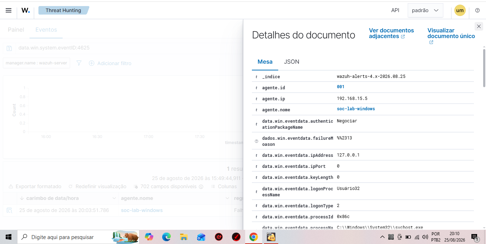

# Lab 04 — Análise de Falha de Logon no Windows (Event ID 4625)

## Objetivo

Este laboratório tem como objetivo analisar uma falha de autenticação em um endpoint Windows monitorado pelo Wazuh SIEM.

Foi realizada uma tentativa controlada de autenticação utilizando uma senha incorreta para gerar o Windows Security Event ID 4625.

A análise busca identificar o usuário envolvido, tipo de logon, origem da tentativa, motivo da falha e severidade atribuída pelo Wazuh.

---

## Ambiente

- SIEM: Wazuh 4.14.7
- Endpoint: Windows
- Agente Wazuh: soc-lab-windows
- Agent ID: 001
- IP do endpoint: 192.168.15.5
- Fonte dos eventos: Windows Security Log

---

## Cenário

Foi realizada uma tentativa de login interativo no endpoint Windows utilizando uma senha incorreta.

Após a falha de autenticação, o evento foi coletado pelo agente Wazuh e enviado ao servidor para análise.

O evento foi localizado no Threat Hunting utilizando o filtro:

`data.win.system.eventID:4625`

---

## Evento analisado

| Campo | Valor |
|---|---|
| Windows Event ID | 4625 |
| Usuário alvo | Lucas |
| Domínio | DESKTOP-O05U1RP |
| Logon Type | 2 |
| IP Address | 127.0.0.1 |
| Logon Process | User32 |
| Status | 0xC000006D |
| SubStatus | 0xC000006A |
| Failure Reason | Nome de usuário desconhecido ou senha incorreta |
| Wazuh Rule ID | 60122 |
| Wazuh Rule Level | 5 |

## Evidência

A captura abaixo apresenta o evento de falha de autenticação identificado no Wazuh Threat Hunting durante a execução do laboratório.

**Evidência 01 — Evento de falha de autenticação (Windows Event ID 4625) coletado e analisado no Wazuh.**

## Análise técnica

### Event ID 4625

O Event ID 4625 é registrado pelo Windows quando ocorre uma tentativa de autenticação que não é concluída com sucesso.

Neste laboratório, o evento foi provocado de forma controlada utilizando uma senha incorreta.

### Logon Type 2

O valor `2` representa um logon interativo, realizado localmente no computador.

Isso é consistente com o cenário executado, no qual a tentativa de autenticação ocorreu diretamente na tela de login do endpoint.

### Endereço 127.0.0.1

O endereço `127.0.0.1` representa o endereço de loopback (localhost).

Neste contexto, a tentativa está associada ao próprio endpoint e não indica, por si só, uma conexão originada de um host remoto.

### Status e SubStatus

O evento apresentou:

`Status: 0xC000006D`

O código indica uma falha de autenticação relacionada a credenciais inválidas.

`SubStatus: 0xC000006A`

O SubStatus permite determinar de forma mais específica que a autenticação falhou devido a uma senha incorreta.

---

## Análise no Wazuh

O Wazuh identificou o evento utilizando:

- Rule ID: 60122
- Rule Level: 5

O alerta foi analisado considerando não apenas sua existência, mas também o contexto da autenticação.

Uma única ocorrência de Event ID 4625 não é suficiente para caracterizar uma tentativa de brute force.

Para determinar se existe comportamento suspeito, seria necessário correlacionar informações como:

- quantidade de falhas;
- intervalo entre as tentativas;
- usuários envolvidos;
- origem das autenticações;
- tipo de logon;
- eventos posteriores de autenticação bem-sucedida.

---

## Triagem SOC

Com base nas evidências coletadas, o evento analisado apresenta características compatíveis com uma falha isolada de autenticação local.

Não foram observadas, neste cenário, evidências suficientes para classificá-lo como brute force.

Em um ambiente corporativo, a investigação deveria continuar caso fossem identificadas múltiplas falhas consecutivas, tentativas contra diferentes usuários ou comportamento anormal relacionado à origem das autenticações.

---

## Conclusão

O laboratório demonstrou como utilizar o Wazuh para identificar e investigar uma falha de autenticação registrada pelo Windows através do Event ID 4625.

A análise dos campos Logon Type, Status, SubStatus, usuário e origem permitiu determinar que a ocorrência foi causada por uma tentativa local utilizando senha incorreta.

O exercício também demonstra a importância da análise contextual: um evento de falha de autenticação isolado não deve ser automaticamente classificado como ataque sem correlação com outras evidências.
