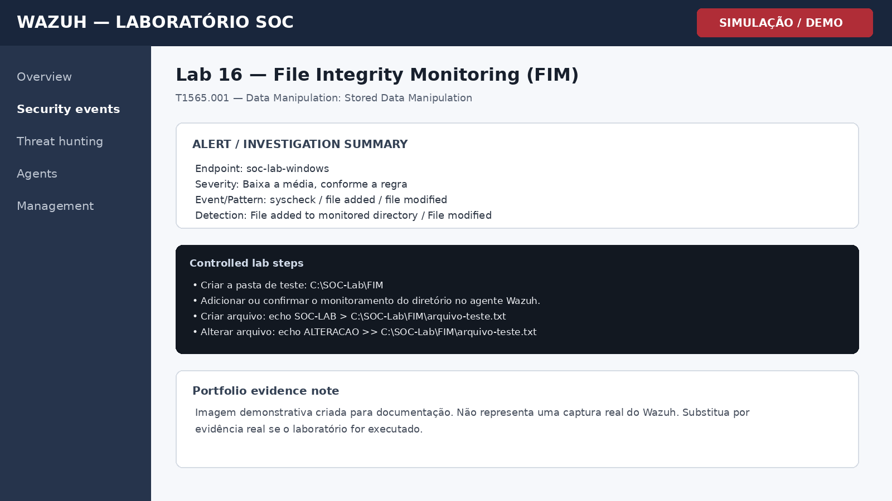

# Lab 16 — File Integrity Monitoring (FIM)

## Objetivo

Monitorar a criação e alteração de um arquivo controlado em diretório acompanhado pelo Wazuh FIM.

## Cenário

Laboratório controlado para prática de monitoramento, triagem e investigação em Wazuh. O objetivo é demonstrar raciocínio de SOC, documentação técnica e associação com conceitos de detecção.

## Procedimento de laboratório

1. Criar a pasta de teste: C:\SOC-Lab\FIM
2. Adicionar ou confirmar o monitoramento do diretório no agente Wazuh.
3. Criar arquivo: echo SOC-LAB > C:\SOC-Lab\FIM\arquivo-teste.txt
4. Alterar arquivo: echo ALTERACAO >> C:\SOC-Lab\FIM\arquivo-teste.txt

## Evidência esperada

| Campo | Valor |
|---|---|
| Endpoint | soc-lab-windows |
| Fonte | Windows / Wazuh |
| Evento ou padrão | syscheck / file added / file modified |
| Regra / detecção | File added to monitored directory / File modified |
| Severidade | Baixa a média, conforme a regra |

## Investigação SOC

- Confirmar caminho completo do arquivo.
- Comparar hash antes e depois da alteração, quando disponível.
- Identificar horário e endpoint que geraram a mudança.
- Verificar se a alteração foi autorizada e se o diretório é sensível.

## MITRE ATT&CK / Referência

**T1565.001 — Data Manipulation: Stored Data Manipulation**

## Registro da investigação

**Perguntas-chave**

- O comportamento foi autorizado?
- Qual usuário e endpoint estão envolvidos?
- Existem eventos relacionados antes ou depois?
- O padrão se repete em outros ativos?
- Há necessidade de contenção ou apenas registro?

## Conclusão

O FIM permite detectar mudanças não autorizadas em arquivos e diretórios críticos e é útil para detecção de persistência, adulteração e comprometimento.

## Evidência visual

> **Nota de transparência:** a imagem acima é uma **simulação visual para documentação de portfólio**. Não é uma captura real do Wazuh.

## Competências demonstradas

- Wazuh / SIEM
- Windows Security Monitoring
- Triagem de alertas
- Investigação SOC
- MITRE ATT&CK
- Documentação técnica
