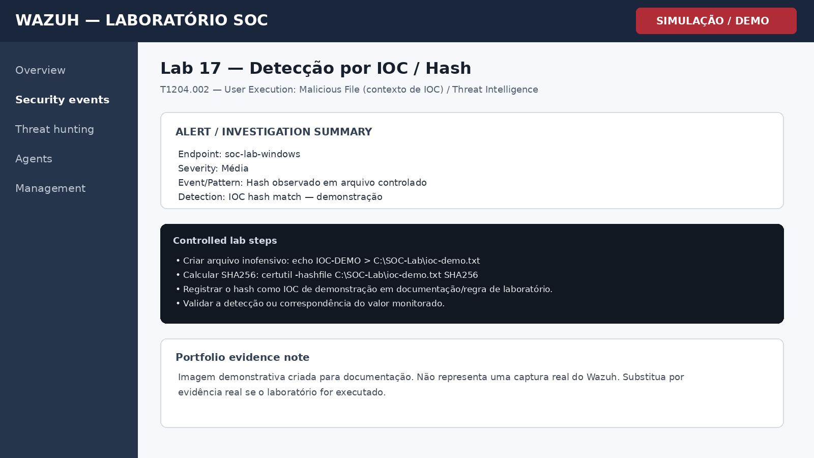

# Lab 17 — Detecção por IOC / Hash

## Objetivo

Simular a identificação de um indicador de comprometimento por hash sem utilizar malware real.

## Cenário

Laboratório controlado para prática de monitoramento, triagem e investigação em Wazuh. O objetivo é demonstrar raciocínio de SOC, documentação técnica e associação com conceitos de detecção.

## Procedimento de laboratório

1. Criar arquivo inofensivo: echo IOC-DEMO > C:\SOC-Lab\ioc-demo.txt
2. Calcular SHA256: certutil -hashfile C:\SOC-Lab\ioc-demo.txt SHA256
3. Registrar o hash como IOC de demonstração em documentação/regra de laboratório.
4. Validar a detecção ou correspondência do valor monitorado.

## Evidência esperada

| Campo | Valor |
|---|---|
| Endpoint | soc-lab-windows |
| Fonte | Windows / Wazuh |
| Evento ou padrão | Hash observado em arquivo controlado |
| Regra / detecção | IOC hash match — demonstração |
| Severidade | Média |

## Investigação SOC

- Capturar SHA256 do arquivo observado.
- Comparar com lista de IOC conhecida/controlada.
- Validar caminho, usuário e origem do arquivo.
- Determinar se o indicador é verdadeiro positivo ou apenas teste.

## MITRE ATT&CK / Referência

**T1204.002 — User Execution: Malicious File (contexto de IOC) / Threat Intelligence**

## Registro da investigação

**Perguntas-chave**

- O comportamento foi autorizado?
- Qual usuário e endpoint estão envolvidos?
- Existem eventos relacionados antes ou depois?
- O padrão se repete em outros ativos?
- Há necessidade de contenção ou apenas registro?

## Conclusão

A correlação de hashes com fontes de inteligência ajuda a enriquecer alertas e priorizar arquivos potencialmente maliciosos.

## Evidência visual

> **Nota de transparência:** a imagem acima é uma **simulação visual para documentação de portfólio**. Não é uma captura real do Wazuh.

## Competências demonstradas

- Wazuh / SIEM
- Windows Security Monitoring
- Triagem de alertas
- Investigação SOC
- MITRE ATT&CK
- Documentação técnica
