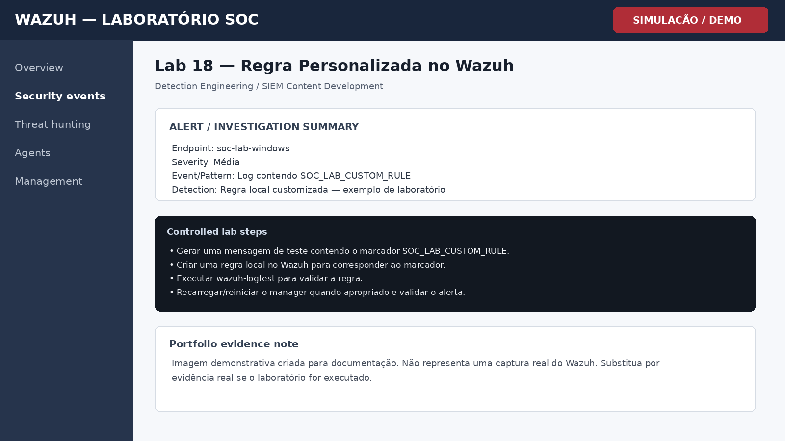

# Lab 18 — Regra Personalizada no Wazuh

## Objetivo

Criar uma regra personalizada simples para detectar um padrão controlado em logs.

## Cenário

Laboratório controlado para prática de monitoramento, triagem e investigação em Wazuh. O objetivo é demonstrar raciocínio de SOC, documentação técnica e associação com conceitos de detecção.

## Procedimento de laboratório

1. Gerar uma mensagem de teste contendo o marcador SOC_LAB_CUSTOM_RULE.
2. Criar uma regra local no Wazuh para corresponder ao marcador.
3. Executar wazuh-logtest para validar a regra.
4. Recarregar/reiniciar o manager quando apropriado e validar o alerta.

## Evidência esperada

| Campo | Valor |
|---|---|
| Endpoint | soc-lab-windows |
| Fonte | Windows / Wazuh |
| Evento ou padrão | Log contendo SOC_LAB_CUSTOM_RULE |
| Regra / detecção | Regra local customizada — exemplo de laboratório |
| Severidade | Média |

## Investigação SOC

- Validar decoder e campos disponíveis.
- Confirmar ID e nível da regra.
- Evitar IDs conflitantes com regras oficiais.
- Registrar lógica, condição e possível falso positivo.

## MITRE ATT&CK / Referência

**Detection Engineering / SIEM Content Development**

## Registro da investigação

**Perguntas-chave**

- O comportamento foi autorizado?
- Qual usuário e endpoint estão envolvidos?
- Existem eventos relacionados antes ou depois?
- O padrão se repete em outros ativos?
- Há necessidade de contenção ou apenas registro?

## Conclusão

A criação de regras personalizadas demonstra capacidade de engenharia de detecção e adaptação do SIEM ao contexto do ambiente.

## Evidência visual

> **Nota de transparência:** a imagem acima é uma **simulação visual para documentação de portfólio**. Não é uma captura real do Wazuh.

## Competências demonstradas

- Wazuh / SIEM
- Windows Security Monitoring
- Triagem de alertas
- Investigação SOC
- MITRE ATT&CK
- Documentação técnica
