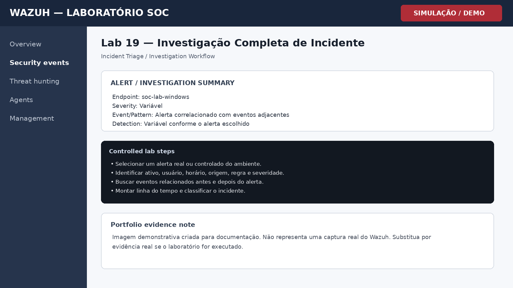

# Lab 19 — Investigação Completa de Incidente

## Objetivo

Conduzir uma investigação estruturada a partir de um alerta, reunindo contexto, evidências e decisão final.

## Cenário

Laboratório controlado para prática de monitoramento, triagem e investigação em Wazuh. O objetivo é demonstrar raciocínio de SOC, documentação técnica e associação com conceitos de detecção.

## Procedimento de laboratório

1. Selecionar um alerta real ou controlado do ambiente.
2. Identificar ativo, usuário, horário, origem, regra e severidade.
3. Buscar eventos relacionados antes e depois do alerta.
4. Montar linha do tempo e classificar o incidente.

## Evidência esperada

| Campo | Valor |
|---|---|
| Endpoint | soc-lab-windows |
| Fonte | Windows / Wazuh |
| Evento ou padrão | Alerta correlacionado com eventos adjacentes |
| Regra / detecção | Variável conforme o alerta escolhido |
| Severidade | Variável |

## Investigação SOC

- Responder: o que aconteceu, quando, onde, com quem e como.
- Buscar eventos predecessores e sucessores.
- Mapear técnica MITRE quando aplicável.
- Definir como verdadeiro positivo, falso positivo ou atividade legítima.

## MITRE ATT&CK / Referência

**Incident Triage / Investigation Workflow**

## Registro da investigação

**Perguntas-chave**

- O comportamento foi autorizado?
- Qual usuário e endpoint estão envolvidos?
- Existem eventos relacionados antes ou depois?
- O padrão se repete em outros ativos?
- Há necessidade de contenção ou apenas registro?

## Conclusão

Uma investigação SOC completa transforma um alerta isolado em uma narrativa técnica com contexto, evidências, impacto e decisão.

## Evidência visual

> **Nota de transparência:** a imagem acima é uma **simulação visual para documentação de portfólio**. Não é uma captura real do Wazuh.

## Competências demonstradas

- Wazuh / SIEM
- Windows Security Monitoring
- Triagem de alertas
- Investigação SOC
- MITRE ATT&CK
- Documentação técnica
