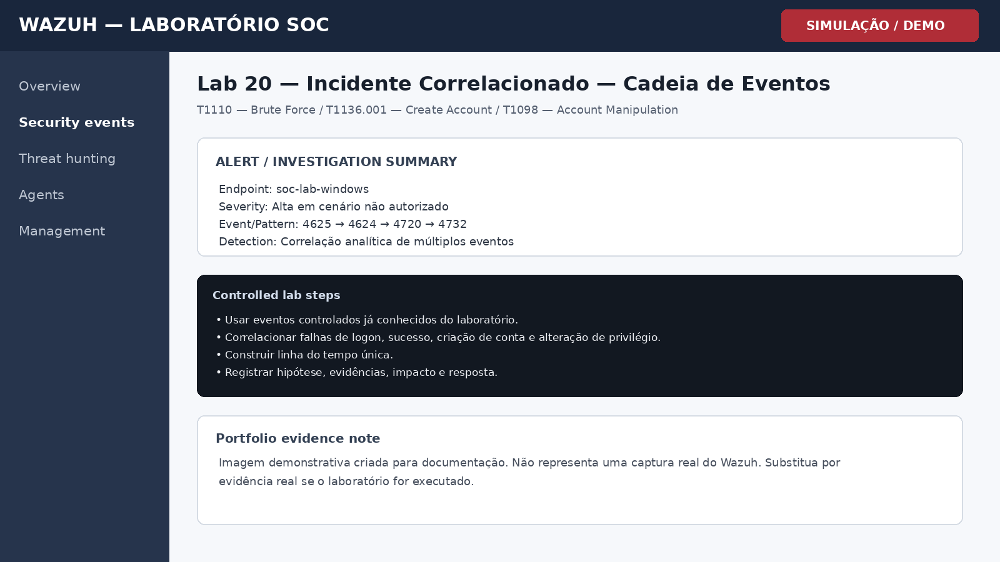

# Lab 20 — Incidente Correlacionado — Cadeia de Eventos

## Objetivo

Documentar um cenário correlacionado com múltiplos eventos para demonstrar raciocínio de SOC e análise de cadeia de ataque.

## Cenário

Laboratório controlado para prática de monitoramento, triagem e investigação em Wazuh. O objetivo é demonstrar raciocínio de SOC, documentação técnica e associação com conceitos de detecção.

## Procedimento de laboratório

1. Usar eventos controlados já conhecidos do laboratório.
2. Correlacionar falhas de logon, sucesso, criação de conta e alteração de privilégio.
3. Construir linha do tempo única.
4. Registrar hipótese, evidências, impacto e resposta.

## Evidência esperada

| Campo | Valor |
|---|---|
| Endpoint | soc-lab-windows |
| Fonte | Windows / Wazuh |
| Evento ou padrão | 4625 → 4624 → 4720 → 4732 |
| Regra / detecção | Correlação analítica de múltiplos eventos |
| Severidade | Alta em cenário não autorizado |

## Investigação SOC

- Verificar se os eventos pertencem ao mesmo usuário, host e janela temporal.
- Distinguir correlação temporal de causalidade comprovada.
- Identificar possíveis etapas de acesso inicial e manipulação de conta.
- Registrar ações recomendadas para contenção e investigação adicional.

## MITRE ATT&CK / Referência

**T1110 — Brute Force / T1136.001 — Create Account / T1098 — Account Manipulation**

## Registro da investigação

**Perguntas-chave**

- O comportamento foi autorizado?
- Qual usuário e endpoint estão envolvidos?
- Existem eventos relacionados antes ou depois?
- O padrão se repete em outros ativos?
- Há necessidade de contenção ou apenas registro?

## Conclusão

A correlação demonstra maturidade analítica superior à leitura isolada de alertas e aproxima o laboratório de um fluxo real de resposta a incidentes.

## Evidência visual

> **Nota de transparência:** a imagem acima é uma **simulação visual para documentação de portfólio**. Não é uma captura real do Wazuh.

## Competências demonstradas

- Wazuh / SIEM
- Windows Security Monitoring
- Triagem de alertas
- Investigação SOC
- MITRE ATT&CK
- Documentação técnica
