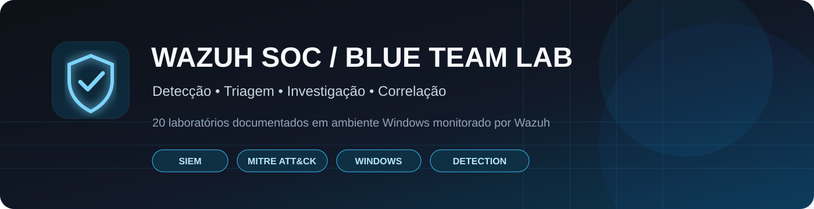
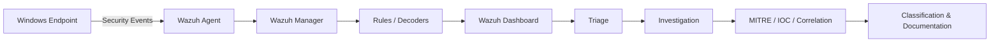
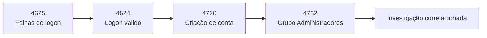

<p align="center">
  
</p>

<p align="center">
  
  
  
  
  
</p>

<p align="center">
  Laboratório prático de <strong>SOC / Blue Team</strong> focado em monitoramento, detecção, triagem, investigação e correlação de eventos de segurança.
</p>

---

## Painel do projeto

| 20 LABS | SIEM | ENDPOINT | FRAMEWORK | FOCO |
|:---:|:---:|:---:|:---:|:---:|
| **01 → 20** | **Wazuh** | **Windows** | **MITRE ATT&CK** | **SOC / Blue Team** |

> **Objetivo:** ir além da geração de alertas. Cada cenário busca interpretar evidências, reconstruir contexto, correlacionar eventos e chegar a uma conclusão técnica.

---

## Arquitetura do laboratório



### Stack

| Componente | Papel |
|---|---|
| **Wazuh SIEM** | Coleta, processamento e correlação |
| **Wazuh Dashboard** | Busca, análise e investigação |
| **Wazuh Agent** | Telemetria do endpoint |
| **Windows Security Logs** | Fonte principal de eventos |
| **PowerShell** | Execuções controladas e análise |
| **VirtualBox** | Ambiente virtualizado |
| **MITRE ATT&CK** | Classificação de técnicas |

---

# Laboratórios

### 01–05 · Identidade e autenticação

| # | Laboratório | Principal evidência |
|:--:|---|---|
| **01** | Criação de usuário | `Event ID 4720` |
| **02** | Inclusão em Administradores | `Event ID 4732` |
| **03** | Logon bem-sucedido | `Event ID 4624` |
| **04** | Falha de logon | `Event ID 4625` |
| **05** | Detecção de força bruta | Correlação de autenticações |

### 06–10 · Execução, persistência e rede

| # | Laboratório | MITRE / foco |
|:--:|---|---|
| **06** | PowerShell suspeito | `T1059.001` |
| **07** | Scheduled Task | `T1053.005` |
| **08** | Criação de serviço | `Event ID 7045` |
| **09** | Port Scan / Reconhecimento | `T1046` |
| **10** | Análise de tráfego PCAP | Network Analysis |

### 11–15 · Threat Intelligence e investigação

| # | Laboratório | Foco |
|:--:|---|---|
| **11** | IOC / Threat Intelligence | Enriquecimento |
| **12** | MITRE ATT&CK | Mapeamento |
| **13** | Correlação de eventos | Timeline |
| **14** | Investigação de incidente | Triage + análise |
| **15** | Desafio Final SOC L1 | Fluxo completo |

### 16–20 · Detection Engineering e correlação

| # | Laboratório | Foco |
|:--:|---|---|
| **16** | File Integrity Monitoring | FIM |
| **17** | IOC / Hash Detection | SHA-256 |
| **18** | Regra personalizada Wazuh | Detection Engineering |
| **19** | Investigação completa | Evidências + timeline |
| **20** | Incidente correlacionado | Cadeia de eventos |

---

## Lab 20 · Correlação em destaque



A análise correlacionada permite transformar eventos isolados em uma **narrativa de incidente**, aumentando a qualidade da triagem e da tomada de decisão.

---

## Processo de investigação

```text
DETECÇÃO
   ↓
TRIAGEM
   ↓
CONTEXTO
   ↓
TIMELINE
   ↓
CORRELAÇÃO
   ↓
MITRE / IOC
   ↓
CLASSIFICAÇÃO
   ↓
DOCUMENTAÇÃO
```

Em cada investigação são observados, quando disponíveis:

`Event ID` · `Rule ID` · `Severity` · `User` · `SID` · `Hostname` · `Process` · `Command Line` · `Source IP` · `Timestamp` · `Hash`

---

## Competências demonstradas

<table>
<tr>
<td width="50%" valign="top">

### SOC Operations

- Event Monitoring
- Incident Triage
- Incident Investigation
- Event Correlation
- Log Analysis
- Incident Documentation

</td>
<td width="50%" valign="top">

### Detection & Intelligence

- Wazuh SIEM
- Detection Engineering
- File Integrity Monitoring
- IOC Analysis
- Threat Intelligence
- MITRE ATT&CK

</td>
</tr>
<tr>
<td width="50%" valign="top">

### Windows Security

- Security Event Logs
- Authentication Events
- Account Management
- PowerShell Monitoring
- Service Creation
- Scheduled Tasks

</td>
<td width="50%" valign="top">

### Network & Analysis

- PCAP Analysis
- Network Reconnaissance
- Hash Analysis
- Timeline Analysis
- False Positive Assessment
- Technical Reporting

</td>
</tr>
</table>

---

## Evidências

As evidências reais produzidas durante a execução dos primeiros laboratórios foram documentadas dentro das respectivas pastas.

Materiais posteriores que utilizam representação visual estão explicitamente identificados como:

> **SIMULAÇÃO / DEMO**

Essas imagens têm finalidade exclusivamente documental e não são apresentadas como capturas reais do ambiente.

---

## Resultado

<table>
<tr>
<td align="center"><strong>COLETA</strong></td>
<td align="center">→</td>
<td align="center"><strong>DETECÇÃO</strong></td>
<td align="center">→</td>
<td align="center"><strong>TRIAGEM</strong></td>
<td align="center">→</td>
<td align="center"><strong>INVESTIGAÇÃO</strong></td>
</tr>
<tr>
<td align="center"><strong>CORRELAÇÃO</strong></td>
<td align="center">→</td>
<td align="center"><strong>THREAT INTEL</strong></td>
<td align="center">→</td>
<td align="center"><strong>MITRE</strong></td>
<td align="center">→</td>
<td align="center"><strong>DOCUMENTAÇÃO</strong></td>
</tr>
</table>

---

<p align="center">
  <strong>Wazuh SOC / Blue Team Lab</strong><br>
  20 laboratórios documentados — do evento isolado à investigação correlacionada.
</p>
